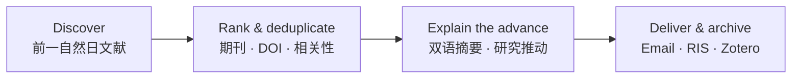
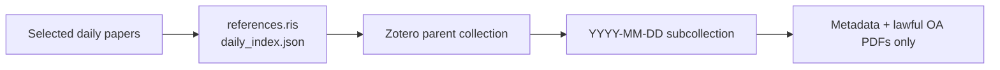

# Daily paper · 每日文献日报

> Turn yesterday's research into a bilingual, evidence-bounded literature brief—delivered to your email and ready for Zotero.
>
> 把前一天的高质量论文变成双语、可追溯、与研究方向直接相关的文献日报。

## One-sentence install in Codex · 在 Codex 中一句话安装

Open Codex and send this single sentence (no terminal or manual file copy required):

```text
请从 GitHub 仓库 fuyuzhe0326/Daily-paper 安装 daily-proppant-literature-brief skill。
```

English prompt:

```text
Install the daily-proppant-literature-brief skill from the GitHub repository fuyuzhe0326/Daily-paper.
```

Codex will install the repository-root skill into its local skills directory. After installation, send `使用 $daily-proppant-literature-brief 配置我的每日文献日报` to start the guided setup. It will first ask for exactly three essentials: your research direction, recipient email, and daily delivery time/timezone.

[English](#english) · [中文](#中文) · [Zotero](#zotero-integration--zotero-联动) · [Quick start](#quick-start--快速开始) · [Try the demo](#try-a-working-demo--一键试运行) · [Contributing](#contributing--参与贡献)

**Suggested GitHub topics:** `codex-skill` · `literature-review` · `research-automation` · `academic-research` · `zotero` · `outlook` · `bilingual`



## Why Daily paper? · 为什么使用它？

| It does | It does not do |
| --- | --- |
| Select up to 10 high-quality, de-duplicated records for your topic | Invent impact factors, rankings, or research conclusions |
| Pair English abstract with a faithful Chinese translation | Fill a zero-result day with older, irrelevant papers |
| Explain the paper's evidence-bounded value for *your* next research decision | Treat a related paper as direct proof of your mechanism |
| Archive `daily_report.txt`, RIS, and a machine-readable index | Save passwords, bypass paywalls, CAPTCHAs, MFA, or institutional access controls |

## Real workflow example · 实际效果示例（去标识化）

```text
DAILY LITERATURE BRIEF                         去标识化实际效果示例
────────────────────────────────────────────────────────────────
ENGLISH JOURNALS

题名：Investigation of key parameters controlling microfracture propagation
中文：控制页岩微裂缝扩展关键参数的研究
期刊：International Journal of Coal Science & Technology
分级：SCI/SCIE Q1 · JCR IF 10.1 (2025)

方法：DEM–FVM 水力—力学耦合；比较应力、干酪根几何与 TOC 情景。
发现：应力区间、干酪根间距与 TOC 阈值会重塑微裂缝连通性。

对研究方向的推动：
  该文并非直接的支撑剂运移证据；但可将储层结构因素作为 CFD–DEM
  支撑剂运移模型的裂缝几何与分流输入，再独立验证颗粒铺置行为。

全文状态：需通过学校已授权会话核验；未绕过访问控制。
```

In a nine-run petroleum-fracturing test, seven runs selected a high-tier English record and two runs correctly reported no qualifying result. Each run produced a self-contained archive. The value is not just a list of papers: it states what was found, how strong the evidence is, what action the researcher can take next, and whether full text is lawfully available.

## Use cases · 适用方向

| Direction | Example configuration outcome |
| --- | --- |
| Petroleum & geoscience · 石油与地学 | Track hydraulic fracturing, proppant transport, CO₂ fracturing, reservoir stimulation, and CFD–DEM studies; distinguish direct particle-transport evidence from engineering applicability. |
| AI & machine learning · 人工智能 | Track a model family, benchmarks, robustness, and deployment constraints; preserve arXiv/DOI de-duplication and label preprints clearly. |
| Materials & biomedicine · 材料与生物医学 | Track a material, mechanism, disease, intervention, or assay; separate journal articles from preprints and flag full-text access states. |

The same workflow can be configured for any research direction with your required terms, exclusions, language coverage, email, delivery time, archive location, and Zotero collection.

## Zotero integration · Zotero 联动

### The practical advantage · 核心亮点

Most daily-literature tools stop at an email or a spreadsheet. Daily paper also leaves a structured, reproducible route into your local Zotero library:



This makes the email a reading brief and Zotero the durable research library. The same paper can then be searched, tagged, cited in a manuscript, and reviewed alongside the exact daily report that selected it.

日报负责“今天该读什么”；Zotero 负责“以后如何检索、引用与复用”。每日报只写入当天的 RIS 题录和已合法取得的 PDF，避免把无关候选、重复 DOI 或未验证附件混进你的主库。

### What is created each day · 每天会生成什么

| Location | Content | Purpose |
| --- | --- | --- |
| Local dated archive | `references.ris` | Standard bibliographic exchange file; can be imported into Zotero even if the local API is unavailable. |
| Local dated archive | `daily_index.json` | Machine-readable source, DOI, status, archive path, and Zotero-item tracking data for de-duplication/retry. |
| Zotero parent collection | One collection for the configured topic | Keeps this project separate from your broader library. |
| Zotero date subcollection | One `YYYY-MM-DD` child collection per run | Lets you trace exactly which papers came from a given daily brief. |
| Zotero items | Bibliographic records and lawful OA PDFs, when available | Keeps metadata and legally obtained attachments together. |

### First-time setup · 首次准备

1. Install and open **Zotero Desktop**.
2. Ensure Zotero's local API/connector is available. In Codex, use the Zotero integration to check status; if asked, allow it to enable the local API and restart Zotero.
3. Choose a parent collection name, for example `Daily literature · Proppant transport` or `每日文献 · 深度学习`.
4. During Daily paper configuration, give this parent-collection name and explicitly authorize the RIS import target.
5. Run one manual test. Confirm that the parent collection, date subcollection, and imported records match the day archive before enabling a schedule.

### Copy-paste configuration prompt · 可直接复制的配置提示词

```text
Use $daily-proppant-literature-brief to configure a daily literature brief.
Research direction: [your research direction and key terms].
Recipient email: [your email].
Delivery time and timezone: [for example, 08:00 Asia/Shanghai].
Archive directory: [your local directory].
Zotero parent collection: [for example, Daily literature · My topic].
First check whether Zotero Desktop and its local API are ready.
After I confirm the destination collection, import each day's generated references.ris
into the matching YYYY-MM-DD Zotero subcollection. Attach only lawfully obtained OA PDFs.
Use my already-authorized Outlook connection and institutional access only.
```

### Daily behavior and safeguards · 每日行为与边界

- **De-duplicate before import:** use DOI, title, and preprint identifier; an import failure must not silently create repeat records on the next run.
- **Keep collections intelligible:** first create or verify the parent collection, then create/use the date subcollection.
- **Separate metadata from access:** a citation can enter Zotero without a PDF. PDFs are attached only when legitimately open access or obtained through an already-authorized institutional session.
- **Never bypass access controls:** a login, CAPTCHA, MFA, payment, licensing gate, or unavailable school session becomes a clearly labelled manual step—not an automated download.
- **Degrade safely:** if Zotero or its local API is unavailable, Daily paper still saves `references.ris` and the daily index. Open Zotero later and import that RIS manually; do not lose the day's bibliography.

### How to use the result · 导入后怎么用

1. Open the configured Zotero parent collection, then the date subcollection.
2. Use the paper card in the email or `daily_report.txt` to decide which papers deserve full reading.
3. Add your own tags, notes, or collections in Zotero without changing the daily archive.
4. When writing, search the Zotero library or export BibTeX/RIS from Zotero; the daily selection provenance remains available in `daily_index.json`.

> Note: Zotero item keys and BibTeX citation keys are different identifiers. The daily index should record the Zotero item key when available; do not treat it as a manuscript citation key.

## Quick start · 快速开始

### Install from GitHub · 从 GitHub 安装

**Recommended:** copy the one-sentence prompt at the top of this README into Codex. If you prefer a terminal, use the following command with Python available:

```powershell
python ~/.codex/skills/.system/skill-installer/scripts/install-skill-from-github.py --repo fuyuzhe0326/Daily-paper --path . --name daily-proppant-literature-brief
```

If your installer version does not accept repository root `--path .`, download or clone the repository and place its contents at `~/.codex/skills/daily-proppant-literature-brief/`. Restart or refresh Codex skills afterwards.

### Configure the skill · 配置技能

Send the following prompt, replacing the brackets:

```text
Use $daily-proppant-literature-brief to configure a daily literature brief.
Research direction: [your research direction and key terms].
Include Chinese journals: [yes/no]. Exclude: [topics to exclude].
Recipient email: [your email].
Delivery time and timezone: [for example, 08:00 Asia/Shanghai].
Archive directory: [your local directory].
Zotero parent collection: [collection name].
Use my already-authorized Outlook connection and already-authorized institutional access only.
```

Codex should confirm your settings, send a test email, then enable the schedule. The skill creates the archive and RIS automatically; no separate export-time setting is required.

## Try a working demo · 一键试运行

No email, Zotero, account, or network authorization is needed for this demo. It uses synthetic metadata to prove the repository can generate a dated report, RIS file, and machine-readable index.

```powershell
python scripts/daily_digest.py --input examples/demo_candidates.json --run-date 2026-08-13 --archive-root demo-output --recipient demo@example.edu
```

Expected output:

```text
demo-output/
└── 2026-08-13/
    ├── candidates.json
    ├── daily_index.json
    ├── daily_report.txt
    └── references.ris
```

The sample deliberately contains a duplicate DOI and an out-of-date record. The generated report should retain only the higher-ranked, in-date record. For a quick built-in check:

```powershell
python scripts/daily_digest.py --self-test
```

## What it delivers · 每日交付内容

- Up to 10 A/B-tier, deduplicated records per day.
- Title translation; authors; journal, type, and traceable IF/proxy metric; DOI/publisher URL; original and Chinese abstracts; methods; findings; and a specific “how this advances my direction” statement.
- A dated folder: `daily_report.txt`, `references.ris`, `daily_index.json`, and `candidates.json`.
- Optional Zotero import and Outlook plain-text email delivery.

## Safe, honest, and reusable · 安全与可信边界

- Never hard-code or store personal email addresses, passwords, cookies, access tokens, or institutional credentials.
- Use only lawful OA links or an already-authorized institutional browser session. Stop at logins, CAPTCHAs, MFA, payment, licensing, or copyright barriers.
- Mark unavailable full text and manual next steps explicitly.
- State zero results honestly. Do not turn a proxy metric into an impact factor or inference into a verified result.

## Local generator · 本地生成器

```powershell
python scripts/daily_digest.py --input candidates.json --run-date 2026-01-31 --archive-root "D:\LiteratureBrief" --recipient "you@example.edu"
python scripts/daily_digest.py --self-test
```

## Contributing · 参与贡献

Contributions are welcome. Please open an Issue before large changes, especially for new sources, ranking rules, email providers, or reference-manager integrations.

Good first contributions include:

- Reusable bilingual query sets for a discipline.
- Transparent journal-tier or metric mappings with sources.
- Test cases for duplicate DOIs, zero-result days, access failures, and Zotero import errors.
- Improvements to report readability and accessibility.

Do not submit account credentials, copyrighted full text, or workflows intended to bypass access controls.

## License

Released under the [MIT License](LICENSE).

## Release notes

See [v0.1.0](CHANGELOG.md#v010---2026-08-14) for the first public, reproducible release: configurable daily selection, bilingual reports, RIS/daily-index archive, lawful-access boundaries, and Zotero-ready workflow documentation.

## English

Daily paper is a configurable Codex skill for daily research discovery, ranking, bilingual explanation, lawful full-text handling, RIS/Zotero archiving, and email delivery.

## 中文

Daily paper 是一个可配置的 Codex 技能，用于每日文献发现、分级筛选、双语解读、合规全文获取、RIS/Zotero 归档和邮件发送。

