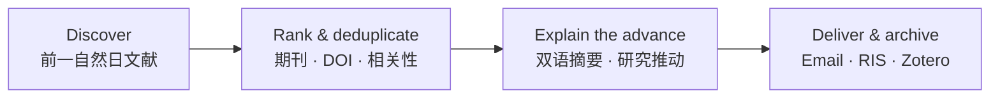

Exit code: 0
Wall time: 0.6 seconds
Output:
# Daily paper · 每日文献日报

> Turn yesterday's research into a bilingual, evidence-bounded literature brief—delivered to your email and ready for Zotero.
>
> 把前一天的高质量论文变成双语、可追溯、与研究方向直接相关的文献日报。

[English](#english) · [中文](#中文) · [Quick start](#quick-start--快速开始) · [Contributing](#contributing--参与贡献)

**Suggested GitHub topics:** `codex-skill` · `literature-review` · `research-automation` · `academic-research` · `zotero` · `outlook` · `bilingual`



## Why Daily paper? · 为什么使用它？

| It does | It does not do |
| --- | --- |
| Select up to 10 high-quality, de-duplicated records for your topic | Invent impact factors, rankings, or research conclusions |
| Pair English abstract with a faithful Chinese translation | Fill a zero-result day with older, irrelevant papers |
| Explain the paper's evidence-bounded value for *your* next research decision | Treat a related paper as direct proof of your mechanism |
| Archive `daily_report.txt`, RIS, and a machine-readable index | Save passwords, bypass paywalls, CAPTCHAs, MFA, or institutional access controls |

## Real workflow example · 实际效果示例（去标识化）

```text
DAILY LITERATURE BRIEF                         去标识化实际效果示例
────────────────────────────────────────────────────────────────
ENGLISH JOURNALS

题名：Investigation of key parameters controlling microfracture propagation
中文：控制页岩微裂缝扩展关键参数的研究
期刊：International Journal of Coal Science & Technology
分级：SCI/SCIE Q1 · JCR IF 10.1 (2025)

方法：DEM–FVM 水力—力学耦合；比较应力、干酪根几何与 TOC 情景。
发现：应力区间、干酪根间距与 TOC 阈值会重塑微裂缝连通性。

对研究方向的推动：
  该文并非直接的支撑剂运移证据；但可将储层结构因素作为 CFD–DEM
  支撑剂运移模型的裂缝几何与分流输入，再独立验证颗粒铺置行为。

全文状态：需通过学校已授权会话核验；未绕过访问控制。
```

In a nine-run petroleum-fracturing test, seven runs selected a high-tier English record and two runs correctly reported no qualifying result. Each run produced a self-contained archive. The value is not just a list of papers: it states what was found, how strong the evidence is, what action the researcher can take next, and whether full text is lawfully available.

## Use cases · 适用方向

| Direction | Example configuration outcome |
| --- | --- |
| Petroleum & geoscience · 石油与地学 | Track hydraulic fracturing, proppant transport, CO₂ fracturing, reservoir stimulation, and CFD–DEM studies; distinguish direct particle-transport evidence from engineering applicability. |
| AI & machine learning · 人工智能 | Track a model family, benchmarks, robustness, and deployment constraints; preserve arXiv/DOI de-duplication and label preprints clearly. |
| Materials & biomedicine · 材料与生物医学 | Track a material, mechanism, disease, intervention, or assay; separate journal articles from preprints and flag full-text access states. |

The same workflow can be configured for any research direction with your required terms, exclusions, language coverage, email, delivery time, archive location, and Zotero collection.

## Quick start · 快速开始

1. Download or clone this repository.
2. Place its contents at `~/.codex/skills/daily-proppant-literature-brief/`.
3. Restart or refresh Codex skills.
4. Send the following prompt, replacing the brackets:

```text
Use $daily-proppant-literature-brief to configure a daily literature brief.
Research direction: [your research direction and key terms].
Include Chinese journals: [yes/no]. Exclude: [topics to exclude].
Recipient email: [your email].
Delivery time and timezone: [for example, 08:00 Asia/Shanghai].
Archive directory: [your local directory].
Zotero parent collection: [collection name].
Use my already-authorized Outlook connection and already-authorized institutional access only.
```

Codex should confirm your settings, send a test email, then enable the schedule. The skill creates the archive and RIS automatically; no separate export-time setting is required.

## What it delivers · 每日交付内容

- Up to 10 A/B-tier, deduplicated records per day.
- Title translation; authors; journal, type, and traceable IF/proxy metric; DOI/publisher URL; original and Chinese abstracts; methods; findings; and a specific “how this advances my direction” statement.
- A dated folder: `daily_report.txt`, `references.ris`, `daily_index.json`, and `candidates.json`.
- Optional Zotero import and Outlook plain-text email delivery.

## Safe, honest, and reusable · 安全与可信边界

- Never hard-code or store personal email addresses, passwords, cookies, access tokens, or institutional credentials.
- Use only lawful OA links or an already-authorized institutional browser session. Stop at logins, CAPTCHAs, MFA, payment, licensing, or copyright barriers.
- Mark unavailable full text and manual next steps explicitly.
- State zero results honestly. Do not turn a proxy metric into an impact factor or inference into a verified result.

## Local generator · 本地生成器

```powershell
python scripts/daily_digest.py --input candidates.json --run-date 2026-01-31 --archive-root "D:\LiteratureBrief" --recipient "you@example.edu"
python scripts/daily_digest.py --self-test
```

## Contributing · 参与贡献

Contributions are welcome. Please open an Issue before large changes, especially for new sources, ranking rules, email providers, or reference-manager integrations.

Good first contributions include:

- Reusable bilingual query sets for a discipline.
- Transparent journal-tier or metric mappings with sources.
- Test cases for duplicate DOIs, zero-result days, access failures, and Zotero import errors.
- Improvements to report readability and accessibility.

Do not submit account credentials, copyrighted full text, or workflows intended to bypass access controls.

## License

Released under the [MIT License](LICENSE).

## English

Daily paper is a configurable Codex skill for daily research discovery, ranking, bilingual explanation, lawful full-text handling, RIS/Zotero archiving, and email delivery.

## 中文

Daily paper 是一个可配置的 Codex 技能，用于每日文献发现、分级筛选、双语解读、合规全文获取、RIS/Zotero 归档和邮件发送。

