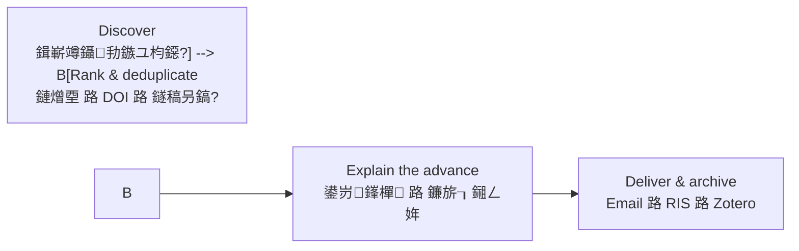
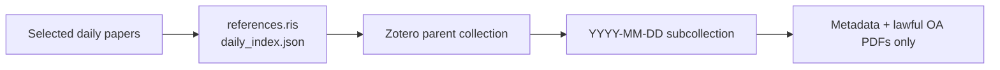

Exit code: 0
Wall time: 0.7 seconds
Output:
# Daily paper 路 姣忔棩鏂囩尞鏃ユ姤

> Turn yesterday's research into a bilingual, evidence-bounded literature brief鈥攄elivered to your email and ready for Zotero.
>
> 鎶婂墠涓€澶╃殑楂樿川閲忚鏂囧彉鎴愬弻璇€佸彲杩芥函銆佷笌鐮旂┒鏂瑰悜鐩存帴鐩稿叧鐨勬枃鐚棩鎶ャ€?
## One-sentence install in Codex 路 鍦?Codex 涓竴鍙ヨ瘽瀹夎

Open Codex and send this single sentence (no terminal or manual file copy required):

```text
璇蜂粠 GitHub 浠撳簱 fuyuzhe0326/Daily-paper 瀹夎 daily-proppant-literature-brief skill銆?```

English prompt:

```text
Install the daily-proppant-literature-brief skill from the GitHub repository fuyuzhe0326/Daily-paper.
```

Codex will install the repository-root skill into its local skills directory. After installation, send `浣跨敤 $daily-proppant-literature-brief 閰嶇疆鎴戠殑姣忔棩鏂囩尞鏃ユ姤` to start the guided setup. It will first ask for exactly three essentials: your research direction, recipient email, and daily delivery time/timezone.

[English](#english) 路 [涓枃](#涓枃) 路 [Zotero](#zotero-integration--zotero-鑱斿姩) 路 [Quick start](#quick-start--蹇€熷紑濮? 路 [Try the demo](#try-a-working-demo--涓€閿瘯杩愯) 路 [Contributing](#contributing--鍙備笌璐＄尞)

**Suggested GitHub topics:** `codex-skill` 路 `literature-review` 路 `research-automation` 路 `academic-research` 路 `zotero` 路 `outlook` 路 `bilingual`



## Why Daily paper? 路 涓轰粈涔堜娇鐢ㄥ畠锛?
| It does | It does not do |
| --- | --- |
| Select up to 10 high-quality, de-duplicated records for your topic | Invent impact factors, rankings, or research conclusions |
| Pair English abstract with a faithful Chinese translation | Fill a zero-result day with older, irrelevant papers |
| Explain the paper's evidence-bounded value for *your* next research decision | Treat a related paper as direct proof of your mechanism |
| Archive `daily_report.txt`, RIS, and a machine-readable index | Save passwords, bypass paywalls, CAPTCHAs, MFA, or institutional access controls |

## Real workflow example 路 瀹為檯鏁堟灉绀轰緥锛堝幓鏍囪瘑鍖栵級

```text
DAILY LITERATURE BRIEF                         鍘绘爣璇嗗寲瀹為檯鏁堟灉绀轰緥
鈹€鈹€鈹€鈹€鈹€鈹€鈹€鈹€鈹€鈹€鈹€鈹€鈹€鈹€鈹€鈹€鈹€鈹€鈹€鈹€鈹€鈹€鈹€鈹€鈹€鈹€鈹€鈹€鈹€鈹€鈹€鈹€鈹€鈹€鈹€鈹€鈹€鈹€鈹€鈹€鈹€鈹€鈹€鈹€鈹€鈹€鈹€鈹€鈹€鈹€鈹€鈹€鈹€鈹€鈹€鈹€鈹€鈹€鈹€鈹€鈹€鈹€鈹€鈹€
ENGLISH JOURNALS

棰樺悕锛欼nvestigation of key parameters controlling microfracture propagation
涓枃锛氭帶鍒堕〉宀╁井瑁傜紳鎵╁睍鍏抽敭鍙傛暟鐨勭爺绌?鏈熷垔锛欼nternational Journal of Coal Science & Technology
鍒嗙骇锛歋CI/SCIE Q1 路 JCR IF 10.1 (2025)

鏂规硶锛欴EM鈥揊VM 姘村姏鈥斿姏瀛﹁€﹀悎锛涙瘮杈冨簲鍔涖€佸共閰牴鍑犱綍涓?TOC 鎯呮櫙銆?鍙戠幇锛氬簲鍔涘尯闂淬€佸共閰牴闂磋窛涓?TOC 闃堝€间細閲嶅寰缂濊繛閫氭€с€?
瀵圭爺绌舵柟鍚戠殑鎺ㄥ姩锛?  璇ユ枃骞堕潪鐩存帴鐨勬敮鎾戝墏杩愮Щ璇佹嵁锛涗絾鍙皢鍌ㄥ眰缁撴瀯鍥犵礌浣滀负 CFD鈥揇EM
  鏀拺鍓傝繍绉绘ā鍨嬬殑瑁傜紳鍑犱綍涓庡垎娴佽緭鍏ワ紝鍐嶇嫭绔嬮獙璇侀绮掗摵缃涓恒€?
鍏ㄦ枃鐘舵€侊細闇€閫氳繃瀛︽牎宸叉巿鏉冧細璇濇牳楠岋紱鏈粫杩囪闂帶鍒躲€?```

In a nine-run petroleum-fracturing test, seven runs selected a high-tier English record and two runs correctly reported no qualifying result. Each run produced a self-contained archive. The value is not just a list of papers: it states what was found, how strong the evidence is, what action the researcher can take next, and whether full text is lawfully available.

## Use cases 路 閫傜敤鏂瑰悜

| Direction | Example configuration outcome |
| --- | --- |
| Petroleum & geoscience 路 鐭虫补涓庡湴瀛?| Track hydraulic fracturing, proppant transport, CO鈧?fracturing, reservoir stimulation, and CFD鈥揇EM studies; distinguish direct particle-transport evidence from engineering applicability. |
| AI & machine learning 路 浜哄伐鏅鸿兘 | Track a model family, benchmarks, robustness, and deployment constraints; preserve arXiv/DOI de-duplication and label preprints clearly. |
| Materials & biomedicine 路 鏉愭枡涓庣敓鐗╁尰瀛?| Track a material, mechanism, disease, intervention, or assay; separate journal articles from preprints and flag full-text access states. |

The same workflow can be configured for any research direction with your required terms, exclusions, language coverage, email, delivery time, archive location, and Zotero collection.

## Zotero integration 路 Zotero 鑱斿姩

### The practical advantage 路 鏍稿績浜偣

Most daily-literature tools stop at an email or a spreadsheet. Daily paper also leaves a structured, reproducible route into your local Zotero library:



This makes the email a reading brief and Zotero the durable research library. The same paper can then be searched, tagged, cited in a manuscript, and reviewed alongside the exact daily report that selected it.

鏃ユ姤璐熻矗鈥滀粖澶╄璇讳粈涔堚€濓紱Zotero 璐熻矗鈥滀互鍚庡浣曟绱€佸紩鐢ㄤ笌澶嶇敤鈥濄€傛瘡鏃ユ姤鍙啓鍏ュ綋澶╃殑 RIS 棰樺綍鍜屽凡鍚堟硶鍙栧緱鐨?PDF锛岄伩鍏嶆妸鏃犲叧鍊欓€夈€侀噸澶?DOI 鎴栨湭楠岃瘉闄勪欢娣疯繘浣犵殑涓诲簱銆?
### What is created each day 路 姣忓ぉ浼氱敓鎴愪粈涔?
| Location | Content | Purpose |
| --- | --- | --- |
| Local dated archive | `references.ris` | Standard bibliographic exchange file; can be imported into Zotero even if the local API is unavailable. |
| Local dated archive | `daily_index.json` | Machine-readable source, DOI, status, archive path, and Zotero-item tracking data for de-duplication/retry. |
| Zotero parent collection | One collection for the configured topic | Keeps this project separate from your broader library. |
| Zotero date subcollection | One `YYYY-MM-DD` child collection per run | Lets you trace exactly which papers came from a given daily brief. |
| Zotero items | Bibliographic records and lawful OA PDFs, when available | Keeps metadata and legally obtained attachments together. |

### First-time setup 路 棣栨鍑嗗

1. Install and open **Zotero Desktop**.
2. Ensure Zotero's local API/connector is available. In Codex, use the Zotero integration to check status; if asked, allow it to enable the local API and restart Zotero.
3. Choose a parent collection name, for example `Daily literature 路 Proppant transport` or `姣忔棩鏂囩尞 路 娣卞害瀛︿範`.
4. During Daily paper configuration, give this parent-collection name and explicitly authorize the RIS import target.
5. Run one manual test. Confirm that the parent collection, date subcollection, and imported records match the day archive before enabling a schedule.

### Copy-paste configuration prompt 路 鍙洿鎺ュ鍒剁殑閰嶇疆鎻愮ず璇?
```text
Use $daily-proppant-literature-brief to configure a daily literature brief.
Research direction: [your research direction and key terms].
Recipient email: [your email].
Delivery time and timezone: [for example, 08:00 Asia/Shanghai].
Archive directory: [your local directory].
Zotero parent collection: [for example, Daily literature 路 My topic].
First check whether Zotero Desktop and its local API are ready.
After I confirm the destination collection, import each day's generated references.ris
into the matching YYYY-MM-DD Zotero subcollection. Attach only lawfully obtained OA PDFs.
Use my already-authorized Outlook connection and institutional access only.
```

### Daily behavior and safeguards 路 姣忔棩琛屼负涓庤竟鐣?
- **De-duplicate before import:** use DOI, title, and preprint identifier; an import failure must not silently create repeat records on the next run.
- **Keep collections intelligible:** first create or verify the parent collection, then create/use the date subcollection.
- **Separate metadata from access:** a citation can enter Zotero without a PDF. PDFs are attached only when legitimately open access or obtained through an already-authorized institutional session.
- **Never bypass access controls:** a login, CAPTCHA, MFA, payment, licensing gate, or unavailable school session becomes a clearly labelled manual step鈥攏ot an automated download.
- **Degrade safely:** if Zotero or its local API is unavailable, Daily paper still saves `references.ris` and the daily index. Open Zotero later and import that RIS manually; do not lose the day's bibliography.

### How to use the result 路 瀵煎叆鍚庢€庝箞鐢?
1. Open the configured Zotero parent collection, then the date subcollection.
2. Use the paper card in the email or `daily_report.txt` to decide which papers deserve full reading.
3. Add your own tags, notes, or collections in Zotero without changing the daily archive.
4. When writing, search the Zotero library or export BibTeX/RIS from Zotero; the daily selection provenance remains available in `daily_index.json`.

> Note: Zotero item keys and BibTeX citation keys are different identifiers. The daily index should record the Zotero item key when available; do not treat it as a manuscript citation key.

## Quick start 路 蹇€熷紑濮?
### Install from GitHub 路 浠?GitHub 瀹夎

**Recommended:** copy the one-sentence prompt at the top of this README into Codex. If you prefer a terminal, use the following command with Python available:

```powershell
python ~/.codex/skills/.system/skill-installer/scripts/install-skill-from-github.py --repo fuyuzhe0326/Daily-paper --path . --name daily-proppant-literature-brief
```

If your installer version does not accept repository root `--path .`, download or clone the repository and place its contents at `~/.codex/skills/daily-proppant-literature-brief/`. Restart or refresh Codex skills afterwards.

### Configure the skill 路 閰嶇疆鎶€鑳?
Send the following prompt, replacing the brackets:

```text
Use $daily-proppant-literature-brief to configure a daily literature brief.
Research direction: [your research direction and key terms].
Include Chinese journals: [yes/no]. Exclude: [topics to exclude].
Recipient email: [your email].
Delivery time and timezone: [for example, 08:00 Asia/Shanghai].
Archive directory: [your local directory].
Zotero parent collection: [collection name].
Use my already-authorized Outlook connection and already-authorized institutional access only.
```

Codex should confirm your settings, send a test email, then enable the schedule. The skill creates the archive and RIS automatically; no separate export-time setting is required.

## Try a working demo 路 涓€閿瘯杩愯

No email, Zotero, account, or network authorization is needed for this demo. It uses synthetic metadata to prove the repository can generate a dated report, RIS file, and machine-readable index.

```powershell
python scripts/daily_digest.py --input examples/demo_candidates.json --run-date 2026-08-13 --archive-root demo-output --recipient demo@example.edu
```

Expected output:

```text
demo-output/
鈹斺攢鈹€ 2026-08-13/
    鈹溾攢鈹€ candidates.json
    鈹溾攢鈹€ daily_index.json
    鈹溾攢鈹€ daily_report.txt
    鈹斺攢鈹€ references.ris
```

The sample deliberately contains a duplicate DOI and an out-of-date record. The generated report should retain only the higher-ranked, in-date record. For a quick built-in check:

```powershell
python scripts/daily_digest.py --self-test
```

## What it delivers 路 姣忔棩浜や粯鍐呭

- Up to 10 A/B-tier, deduplicated records per day.
- Title translation; authors; journal, type, and traceable IF/proxy metric; DOI/publisher URL; original and Chinese abstracts; methods; findings; and a specific 鈥渉ow this advances my direction鈥?statement.
- A dated folder: `daily_report.txt`, `references.ris`, `daily_index.json`, and `candidates.json`.
- Optional Zotero import and Outlook plain-text email delivery.

## Safe, honest, and reusable 路 瀹夊叏涓庡彲淇¤竟鐣?
- Never hard-code or store personal email addresses, passwords, cookies, access tokens, or institutional credentials.
- Use only lawful OA links or an already-authorized institutional browser session. Stop at logins, CAPTCHAs, MFA, payment, licensing, or copyright barriers.
- Mark unavailable full text and manual next steps explicitly.
- State zero results honestly. Do not turn a proxy metric into an impact factor or inference into a verified result.

## Local generator 路 鏈湴鐢熸垚鍣?
```powershell
python scripts/daily_digest.py --input candidates.json --run-date 2026-01-31 --archive-root "D:\LiteratureBrief" --recipient "you@example.edu"
python scripts/daily_digest.py --self-test
```

## Contributing 路 鍙備笌璐＄尞

Contributions are welcome. Please open an Issue before large changes, especially for new sources, ranking rules, email providers, or reference-manager integrations.

Good first contributions include:

- Reusable bilingual query sets for a discipline.
- Transparent journal-tier or metric mappings with sources.
- Test cases for duplicate DOIs, zero-result days, access failures, and Zotero import errors.
- Improvements to report readability and accessibility.

Do not submit account credentials, copyrighted full text, or workflows intended to bypass access controls.

## License

Released under the [MIT License](LICENSE).

## Release notes

See [v0.1.0](CHANGELOG.md#v010---2026-08-14) for the first public, reproducible release: configurable daily selection, bilingual reports, RIS/daily-index archive, lawful-access boundaries, and Zotero-ready workflow documentation.

## English

Daily paper is a configurable Codex skill for daily research discovery, ranking, bilingual explanation, lawful full-text handling, RIS/Zotero archiving, and email delivery.

## 涓枃

Daily paper 鏄竴涓彲閰嶇疆鐨?Codex 鎶€鑳斤紝鐢ㄤ簬姣忔棩鏂囩尞鍙戠幇銆佸垎绾х瓫閫夈€佸弻璇В璇汇€佸悎瑙勫叏鏂囪幏鍙栥€丷IS/Zotero 褰掓。鍜岄偖浠跺彂閫併€?
